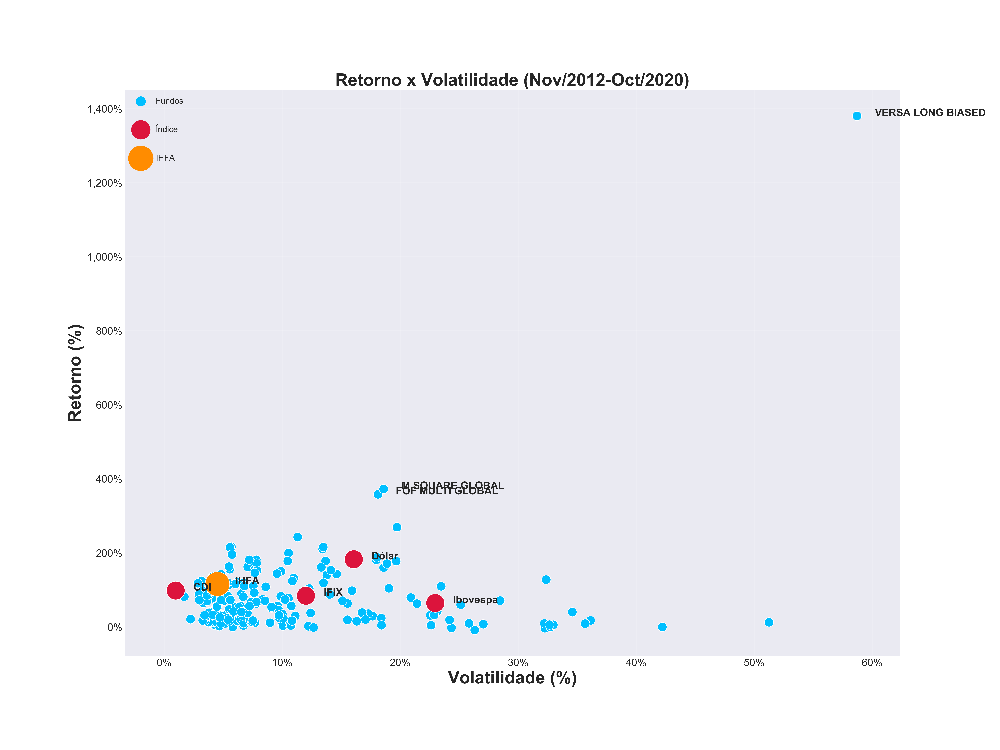
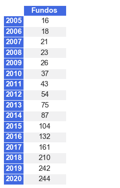

# Análise do IHFA - Índice de Hedge Funds ANBIMA

O IHFA (Índice de Hedge Funds ANBIMA) é uma referência para a indústria de hedge funds. No Brasil, esses produtos se assemelham aos fundos multimercado de gestão ativa, com aplicações em diversos segmentos do mercado e várias estratégias de investimento.

O índice conta com os fundos mais representativos do segmento em sua carteira e para garantir a representatividade, o IHFA é ajustado trimestralmente, seguindo os seguintes critérios qualitativos e quantitativos:

- Seleção apenas dos fundos multimercados que estejam enquadrados nessa classe há mais de um ano.
- Exclusão dos fundos fechados, dos exclusivos e daqueles que não cobram taxa de performance.
- Exclusão dos fundos com número médio de cotistas inferior a dez no trimestre anterior à data de rebalanceamento.
- Exclusão dos fundos que não divulgam o valor das cotas atualizadas diariamente.

O objetivo desta análise é verificar os retornos, volitilidade e outras estatísticas dos fundos presente no índice.

Input files:
- IHF_TEORICO.csv: https://www.anbima.com.br/pt_br/informar/consulta-ihfa.htm
- data.xlsx: preencher manualmente

Fontes:
- Histórico IHFA: https://inva.capital/brasil/wp-content/uploads/sites/4/2020/07/2020-07.pdf
- Histórico CDI e IPCA: https://www.debit.com.br/tabelas/tabela-completa.php?indice=cdi
- Histórico IBOV, IFIX e Dólar: https://br.investing.com/

Output files:
- Indicadores: retorno_tabela.png
- Relação Retorno x Volatilidade: retorno-vol.png
- Fundos mais antigos: fundos_mais_antigos.png
- Quantidade de fundos por ano de origem: fundos_por_ano.png

TODO:
- Obter dados do IHFA desde mai/2008 (origem do índice). Até o momento só possuo desde de nov/2012

## Indicadores da performance do índice

## Relação Retorno x Volatilidade dos fundos presente no índice 

## Fundos mais antigos

## Quantidade de fundos presente no índice por ano de criação

